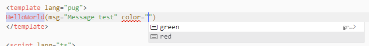
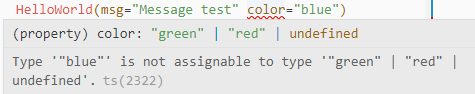

# vue-npm-library-example

This library is an exemple of how to create and build a modern web component library using <b>Vue3 + Typescript</b>. The build is ready to create all necessary files to deploy on npm and use components with types helpers.

[](https://www.npmjs.com/package/vue-npm-library-example)
[](https://github.com/agrisom/vue-npm-library-example/tags)
[](https://github.com/agrisom/vue-components-docs/blob/main/LICENSE)

# How it works

- [x] Build tool [Vite](https://vitejs.dev/)
- [x] Build TS tool [rollup-plugin-typescript2](https://github.com/ezolenko/rollup-plugin-typescript2)
- [x] Framework [Vue 3](https://vuejs.org/)
- [x] Type system [TypeScript](https://www.typescriptlang.org/) / [Vue tsc](https://github.com/johnsoncodehk/volar/tree/master/packages/vue-tsc)
- [x] Vue SFC Setup [script setup](https://vuejs.org/api/sfc-script-setup.html)
- [x] Publish repository [npm](https://www.npmjs.com/package/vue-npm-library-example)

# Quick start
You need [Vue.js](https://vuejs.org) version 3.2+

## 1. Install via npm
```
npm install vue-npm-library-example
```

## 2. Import

You can import the library depending on the project needs. Import all components globaly, import single components globaly or import individual component where it's used.

- Declare all components globaly.

    **main.ts**

    ```
    import VueLibraryLoader from 'vue-npm-library-example';

    const app = createApp(App);
    app.use(VueLibraryLoader);
    ```

- Declare global components (Treeshaking).

    **main.ts**

    ```
    import { HelloWorld } from 'vue-npm-library-example';

    const app = createApp(App);
    app.component('HelloWorld', HelloWorld);
    ```

- Declare components localy.
    
    **\*.vue**

    ```
    <script setup lang="ts">
    import { HelloWorld } from 'vue-npm-library-example';
    </script>
    ```


## 3. Use components

Implement each component normally on the template section **\*.vue**
    
```
<template>
<HelloWorld msg="Message test" color="green" />
</template>
```

**TIP: Typescript + Volar**

> Typescript provides helpers to implement component props and validates incorrect or undefined values.





# Repository
Check out the code on github, [agrisom/vue-npm-library-example](https://github.com/agrisom/vue-npm-library-example).

# Collaborators
[](https://github.com/agrisom)

# Changelog
All notable changes to this project will be documented in this file.

## [0.0.4] - 2022-09-14
- Added new component UITable

View github [changelog](https://github.com/agrisom/vue-npm-library-example/compare/V0.0.3...V0.0.4)

## [0.0.3] - 2022-09-01
- Fix README style

View github [changelog](https://github.com/agrisom/vue-npm-library-example/compare/V0.0.2...V0.0.3)

## [0.0.2] - 2022-09-01
- Completes README.md

View github [changelog](https://github.com/agrisom/vue-npm-library-example/compare/V0.0.1...V0.0.2)

## [0.0.1] - 2022-09-01
- First commit.
- Added project configurations.
- Added component example (HelloWorld).
